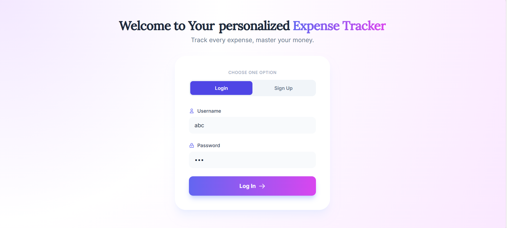
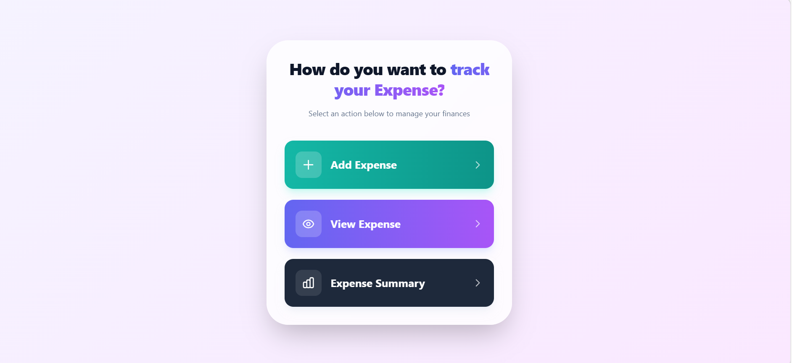
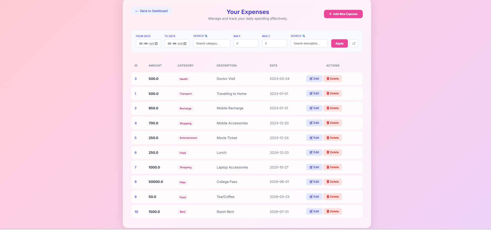
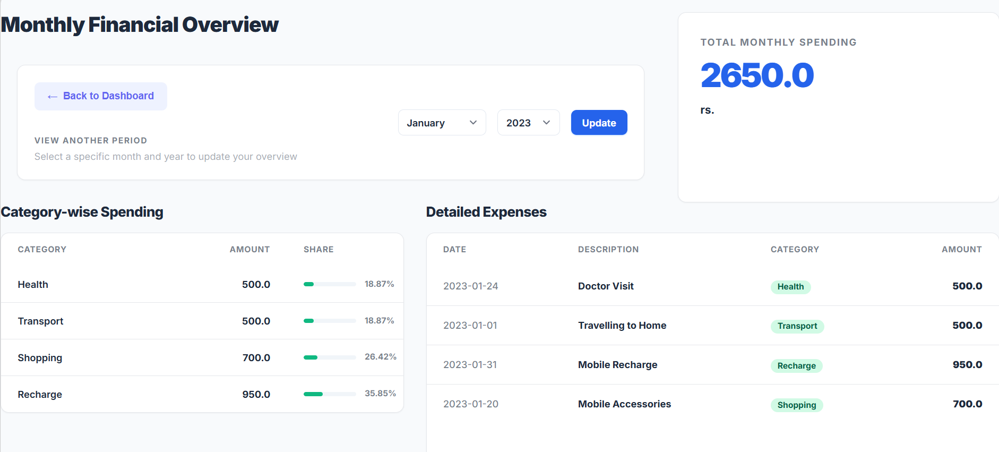
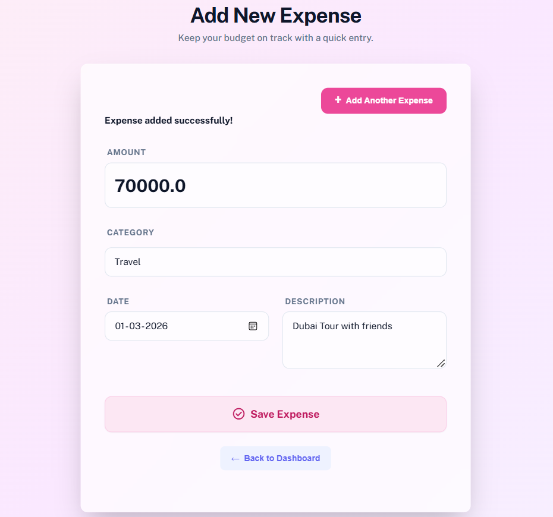
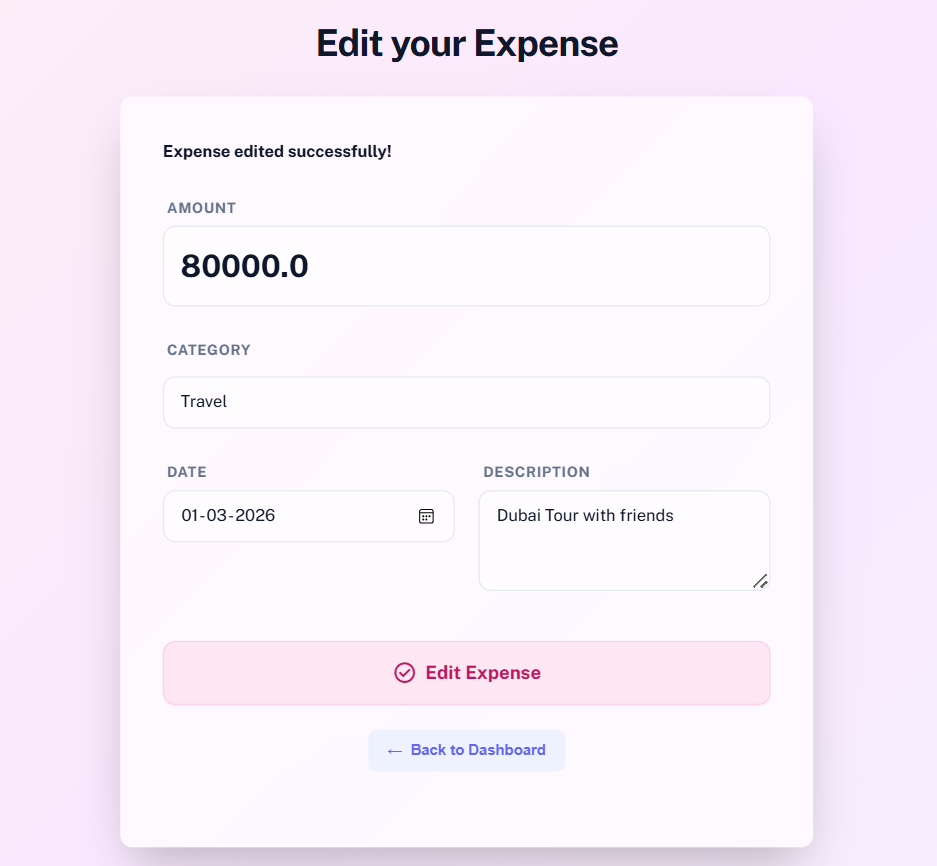

# 💰 Personal Expense Tracker

A full-stack web application to help users record, manage, and analyze their daily expenses through a simple and clean web interface. Built to make tracking spending easy and to surface real insights into financial habits.

## 🎥 Demo Video

https://github.com/user-attachments/assets/4823f72f-ef38-4ca9-8b62-fdcfda44f73d

## 📸 Screenshots

<!-- Add your project screenshots below. Replace the paths with your actual image files, e.g. assets/login-screen.png -->

| Login Screen | Dashboard |
|---|---|
|  |  |

| All Expenses | Monthly Financial Overview |
|---|---|
|  |  |

| Add Expense | Edit Expense |
|---|---|
|  |  |

## ✨ Key Features

- 📝 Add, edit, and categorize daily expenses
- 🔐 Secure login screen for user access
- 📊 View a monthly financial overview
- 📅 Filter expenses by month and year
- 🥧 Category-wise spending analysis with percentage share
- 📋 Detailed expense history table for better visibility

## 🛠️ Tech Stack

- **Backend:** Java (JSP & Servlets)
- **Database:** Oracle Database
- **Database Connectivity:** JDBC
- **Frontend:** HTML, CSS, Tailwind CSS
- **Server:** Apache Tomcat

## 🏗️ Architecture

The application follows a classic **MVC-style architecture** on Java EE:

- **Servlets** handle incoming requests, business logic, and control flow
- **JSP pages** render the dynamic frontend views
- **JDBC** connects the application to the Oracle Database for persistence
- **HTML / CSS / Tailwind CSS** style and structure the user interface

## ⚙️ Getting Started

### Prerequisites

- Java Development Kit (JDK) 8 or higher
- Apache Tomcat (9.x or higher recommended)
- Oracle Database (with an active service/schema)
- Oracle JDBC Driver (`ojdbc.jar`)
- An IDE such as Eclipse or IntelliJ IDEA (optional, but recommended)

### Installation

1. **Clone the repository**
   ```bash
   git clone https://github.com/<your-username>/<your-repo-name>.git
   cd <your-repo-name>
   ```

2. **Set up the Oracle Database**
   - Create a new schema/user in your Oracle instance
   - Run the SQL scripts (if included in the repo, e.g. `/db/schema.sql`) to create the required tables

3. **Configure the database connection**
   - Update your JDBC connection details (URL, username, password) in the relevant config/DAO file, e.g.:
     ```java
     String url = "jdbc:oracle:thin:@localhost:1521:xe";
     String username = "your_username";
     String password = "your_password";
     ```

4. **Add the Oracle JDBC driver**
   - Place `ojdbc.jar` in your project's `WEB-INF/lib` folder (or your Tomcat `lib` folder)

5. **Deploy to Apache Tomcat**
   - Build/export the project as a `.war` file
   - Place it in Tomcat's `webapps` directory, or deploy directly via your IDE

6. **Run the application**
   - Start Tomcat
   - Open your browser and navigate to:
     ```
     http://localhost:8080/<app-name>/
     ```

## 📖 What This Project Taught Me

- Building dynamic web pages using JSP and Servlets
- Connecting Java applications with databases using JDBC
- Designing and querying relational databases in Oracle SQL
- Implementing server-side filtering and data aggregation
- Structuring a complete full-stack web application from frontend to backend


## 📄 License

This project is open source. Feel free to use and modify it for learning purposes.

---

⭐ If you found this project helpful, consider giving it a star on GitHub!
